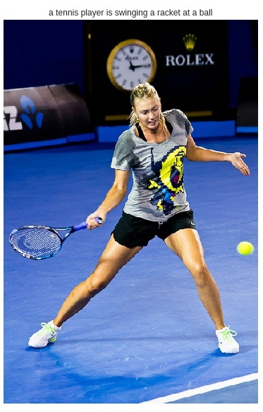
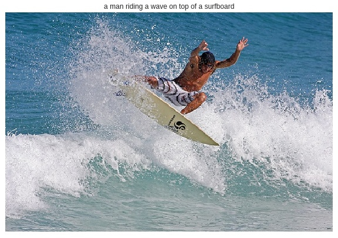
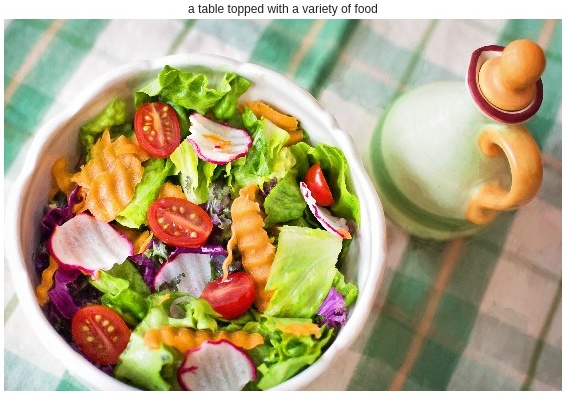
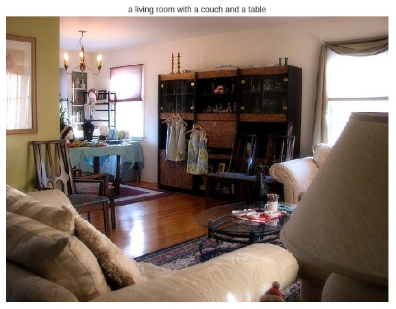
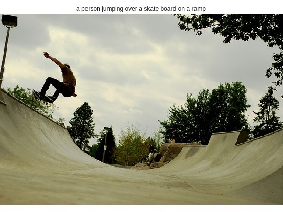
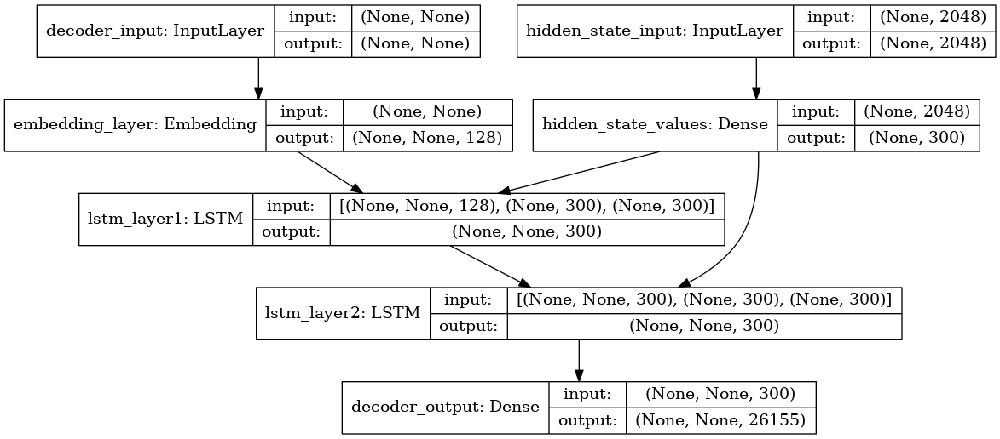

# Image Summarization
Image summary generation or caption generation for images using CNN-LSTM network. The model used  dataset for training the model. The entire implementation is done in Keras.

### Model Performance on Test Images:
The model was trained for 22 epochs. The results are quite convincing.

### Model Architecture

    

#### References:
MSCOCO dataset was downloaded from . 
Sparse entropy loss function bug fix from 

